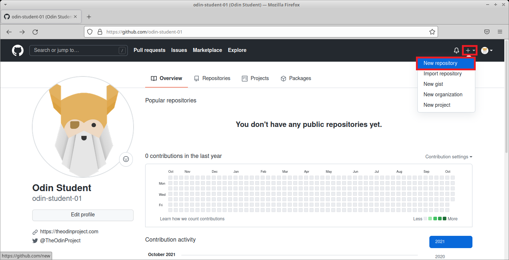
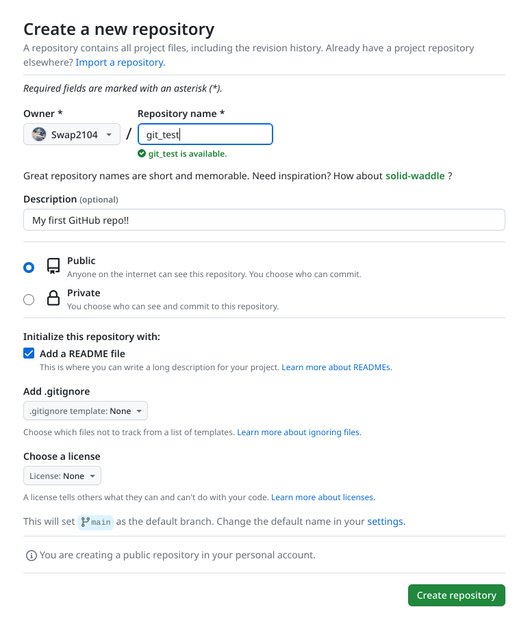
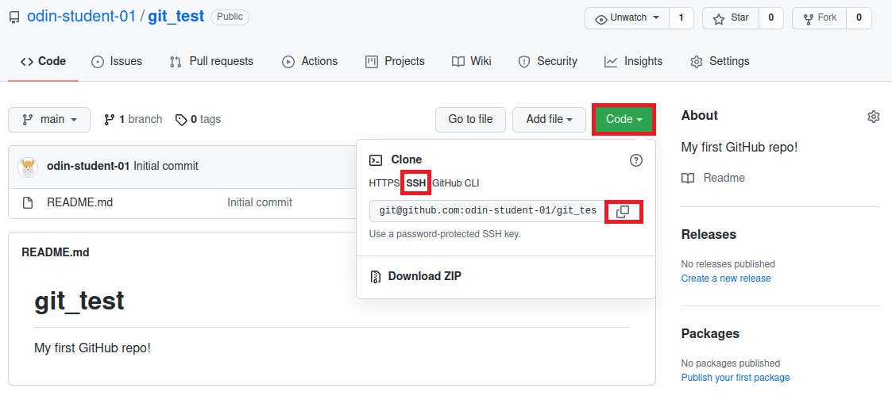
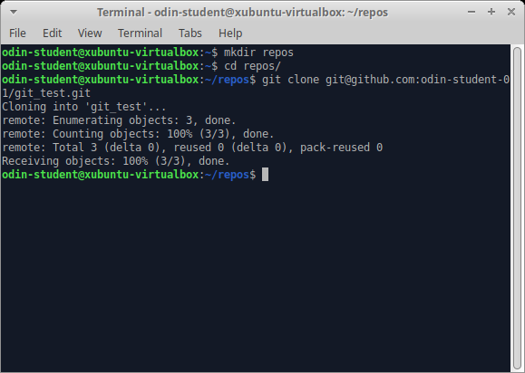

# GITHUB
GitHubの基本に関するドキュメント
#　流れ

1.[新しいリポジトリを作成する方法]() 


## 新しいリポジトリを作成する方法

---

以下のスクリーンショットに表示されているボタンをクリックして新しいリポジトリを作成してください。



-リポジトリに名前を付けます（例ではgit_testです）。
-他の人にリポジトリを見られても構わない場合はpublicをクリックします。そして、無料ユーザーでもGitHubページに投稿したい場合は。
-他の人に許可なしにリポジトリを見られるのを防ぐ場合はprivateをクリックします。（ただし、有料版を購入していない限り、GitHubページにデプロイすることはできません）
-readmeファイルが欲しい場合は、readmeファイルを追加するをチェックします。
-完了したら、リポジトリを作成するをクリックします。




これにより、新しいリポジトリがGitHub上にリダイレクトされます。このリポジトリをローカルマシンにコピー（クローン）する準備をするには、緑色の「Code」ボタンをクリックします。その後、SSHオプションを選択し、その下の行をコピーします。
**注意: 正しいURLを取得するには、SSHオプションをクリックする必要があります。**



では、ターミナルに移動し、もしリポジトリ用のフォルダをまだ作成していない場合は作成してください（*オプションですがおすすめです*）。
- 作成したフォルダに移動します。
- GitHubからリポジトリをコンピューターにクローンします。`git clone`の後にコピーしたURLを使用してください。
- 以下のような形式であるべきです。

```bash
git clone git@github.com:USER-NAME/REPOSITORY-NAME.git
```

**もしURLが以下のような形式であれば、**

```plaintext
https://github.com/USER-NAME/REPOSITORY-NAME.git
```

**HTTPオプションを選択しているため、必要なSSHオプションではありません。**




完了です！GitHubで作成したリポジトリをローカルマシンに正常に接続しました。これをテストするには、新しい**git_test**フォルダに移動して、コマンドラインで`git remote -v`を入力します。これにより、ローカルコピーのリモートであるGitHubで作成したリポジトリのURLが表示されます。また、`git remote -v`の出力の先頭に**origin**という単語が表示されることに気付いたかもしれません。これは、リモート接続の名前です。名前「origin」は、リモートリポジトリのデフォルトであり、慣例です。


