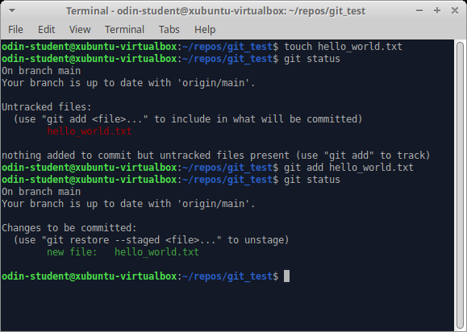

# GITHUB
GitHubの基本に関するドキュメント


#　流れ

1. [新しいリポジトリを作成する方法](https://github.com/sumamin-inc-organization/GITHUB?tab=readme-ov-file#%E6%96%B0%E3%81%97%E3%81%84%E3%83%AA%E3%83%9D%E3%82%B8%E3%83%88%E3%83%AA%E3%82%92%E4%BD%9C%E6%88%90%E3%81%99%E3%82%8B%E6%96%B9%E6%B3%95) 

2. [Git ワークフロー](https://github.com/sumamin-inc-organization/GITHUB?tab=readme-ov-file#git-%E3%83%AF%E3%83%BC%E3%82%AF%E3%83%95%E3%83%AD%E3%83%BC)

3. [git チートシート](https://github.com/sumamin-inc-organization/GITHUB?tab=readme-ov-file#git-%E3%83%81%E3%83%BC%E3%83%88%E3%82%B7%E3%83%BC%E3%83%88)
    - [リポジトリの作成](https://github.com/sumamin-inc-organization/GITHUB?tab=readme-ov-file#%E3%83%AA%E3%83%9D%E3%82%B8%E3%83%88%E3%83%AA%E3%81%AE%E4%BD%9C%E6%88%90)
    - [変更の作成](https://github.com/sumamin-inc-organization/GITHUB?tab=readme-ov-file#%E5%A4%89%E6%9B%B4%E3%81%AE%E4%BD%9C%E6%88%90)
    - [履歴の確認](https://github.com/sumamin-inc-organization/GITHUB?tab=readme-ov-file#%E5%B1%A5%E6%AD%B4%E3%81%AE%E7%A2%BA%E8%AA%8D)
    - [ファイル名の整理](https://github.com/sumamin-inc-organization/GITHUB?tab=readme-ov-file#%E3%83%95%E3%82%A1%E3%82%A4%E3%83%AB%E5%90%8D%E3%81%AE%E6%95%B4%E7%90%86)
    - [断片の保存](https://github.com/sumamin-inc-organization/GITHUB?tab=readme-ov-file#%E6%96%AD%E7%89%87%E3%81%AE%E4%BF%9D%E5%AD%98)  
    - [コミットの修正](https://github.com/sumamin-inc-organization/GITHUB?tab=readme-ov-file#%E3%82%B3%E3%83%9F%E3%83%83%E3%83%88%E3%81%AE%E4%BF%AE%E6%AD%A3)
    - [変更の整理](https://github.com/sumamin-inc-organization/GITHUB?tab=readme-ov-file#%E5%A4%89%E6%9B%B4%E3%81%AE%E6%95%B4%E7%90%86)
    - [変更の同期](https://github.com/sumamin-inc-organization/GITHUB?tab=readme-ov-file#%E5%A4%89%E6%9B%B4%E3%81%AE%E5%90%8C%E6%9C%9F)


---

## 新しいリポジトリを作成する方法

---

以下のスクリーンショットに表示されているボタンをクリックして新しいリポジトリを作成してください。


-リポジトリに名前を付けます（例ではgit_testです）。
-他の人にリポジトリを見られても構わない場合はpublicをクリックします。そして、無料ユーザーでもGitHubページに投稿したい場合は。
-他の人に許可なしにリポジトリを見られるのを防ぐ場合はprivateをクリックします。（ただし、有料版を購入していない限り、GitHubページにデプロイすることはできません）
-readmeファイルが欲しい場合は、readmeファイルを追加するをチェックします。
-完了したら、リポジトリを作成するをクリックします。


これにより、新しいリポジトリがGitHub上にリダイレクトされます。このリポジトリをローカルマシンにコピー（クローン）する準備をするには、緑色の「Code」ボタンをクリックします。その後、SSHオプションを選択し、その下の行をコピーします。
**注意: 正しいURLを取得するには、SSHオプションをクリックする必要があります。**


では、ターミナルに移動し、もしリポジトリ用のフォルダをまだ作成していない場合は作成してください（*オプションですがおすすめです*）。
- 作成したフォルダに移動します。
- GitHubからリポジトリをコンピューターにクローンします。`git clone`の後にコピーしたURLを使用してください。
- 以下のような形式であるべきです。

```bash
git clone git@github.com:USER-NAME/REPOSITORY-NAME.git
```

**もしURLが以下のような形式であれば、**

```plaintext
https://github.com/USER-NAME/REPOSITORY-NAME.git
```

**HTTPオプションを選択しているため、必要なSSHオプションではありません。**


完了です！GitHubで作成したリポジトリをローカルマシンに正常に接続しました。これをテストするには、新しい**git_test**フォルダに移動して、コマンドラインで`git remote -v`を入力します。これにより、ローカルコピーのリモートであるGitHubで作成したリポジトリのURLが表示されます。また、`git remote -v`の出力の先頭に**origin**という単語が表示されることに気付いたかもしれません。これは、リモート接続の名前です。名前「origin」は、リモートリポジトリのデフォルトであり、慣例です。

---

## Git ワークフロー

---

例のワークフロー: 


1. `hello_world.txt`という新しいファイルを`git_test`フォルダ内に作成するには、次のコマンドを使用します：

```bash
touch hello_world.txt
```


2. ターミナルで `git status` を入力します。出力で、`hello_world.txt` ファイルが赤で表示されていることに注意してください。これは、このファイルがステージされていないことを意味します。


3. `git add hello_world.txt` を入力します。このコマンドは、`hello_world.txt` ファイルを Git のステージングエリアに追加します。ステージングエリアは、Git でコミットを行うための二段階プロセスの一部です。ステージングエリアを変更の「待合室」と考えてください。これで、再度 `git status` を入力します。出力で、ファイルが今や緑色で表示されていることに注意してください。これは、ファイルが現在ステージングエリアにあることを意味します。




4. `git commit -m "Add hello_world.txt"` を入力し、次にもう一度 `git status` を入力します。出力には、「nothing to commit, working tree clean」と表示されるはずです。これは、変更がコミットされたことを示しています。もし "upstream is gone" というメッセージが表示された場合、心配する必要はありません。これは、クローンしたリポジトリに現在ブランチがない場合にのみ表示され、このプロジェクトの残りの手順に従うと解決されます。

<em>メッセージ「Your branch is ahead of ‘origin/main’ by 1 commit」は、今、リモートリポジトリよりも新しいスナップショットを持っていることを意味します。この後の手順で、これらのスナップショットをアップロードします。</em>


5. `git log` を入力し、出力を確認します。"Add hello_world.txt" コミットのエントリーが表示されるはずです。コミットを行った著者や、コミットが行われた日時の詳細も表示されます。もしターミナルが "(END)" と表示された状態で止まっている場合は、単に "q" を押して終了します。これに関する設定は後で行うことができますが、現時点ではあまり心配する必要はありません。


 

---

## git チートシート

---

### リポジトリの作成

- `git init [project-name]` => 指定した名前のローカルリポジトリを作成します
- `git clone [url]` => プロジェクトとすべてのバージョン履歴をダウンロードします

### 変更の作成

- `git status` => コミット可能なすべての新規または変更のあるファイルを一覧で表示します
- `git diff` => まだステージされていないファイルの差分を表示します
- `git add [file]` => バージョン管理のためにファイルのスナップショットを作成します
- `git diff --staged` => ステージングと最後のファイルバージョンとの差分を表示します
- `git reset [file]` => ファイルをステージングから外しますが、その内容は保持します
- `git commit -m "[descriptive message]"` => ファイルのスナップショットをバージョン履歴内に恒久的に記録します

### 履歴の確認

- `git log`  => 現在アクティブなブランチのコミット履歴を表示します。

- `git log --follow [file]` => ファイルを変更したコミットを表示し、リネームを超えても表示します

### ファイル名の整理 

- `git rm [file]` => 作業ディレクトリからファイルを削除し、削除をステージします
- `git mv [file-original] [file-renamed]` => ファイル名を変更し、コミットします

### 断片の保存

- `git stash` => すべての変更のあるトラックされているファイルを一時的に保存します
- `git stash pop` => 直近に一時保存されたファイルを復旧します
- `git stash list` => すべての一時保存された変更セットを一覧で表示します
- `git stash drop` => 直近に一時保存された変更セットを破棄します

### コミットの修正

- `git reset [commit]` => `commit` 以降すべてのコミットを取り消し、ローカルでは変更を保持します
- `git reset --hard [commit]` => 指定されたコミットに戻り、それ以降のすべての変更を破棄します

### 変更の整理

- `git branch` => 現在のリポジトリ上のすべてのローカルブランチを一覧で表示します
- `git branch [branch-name]` => 新規ブランチを作成します
- `git checkout [branch-name]` => 指定されたブランチに切り替え、作業ディレクトリを更新します
- `git checkout -b [branch-name]` => [branch name] ブランチを作成し、そのブランチに移動します
- `git branch --show-current` =>  現在のブランチを表示
- `git branch --show` => 現在のブランチを表示します（Git 2.22以上で利用可能）

### 変更の同期

- `git fetch [bookmark]` => リポジトリブックマークからすべての履歴をダウンロードします
- `git merge [bookmark]/[branch]` => ブックマークのブランチを現在のローカルブランチに統合します
- `git push [alias] [branch]` => すべてのローカルブランチのコミットをGitHubにアップロードします
- `git pull` => ブックマークの履歴をダウンロードし、変更を統合します
